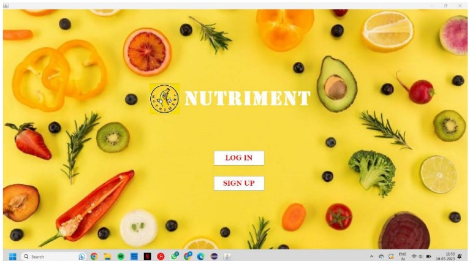
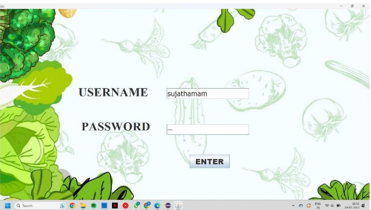
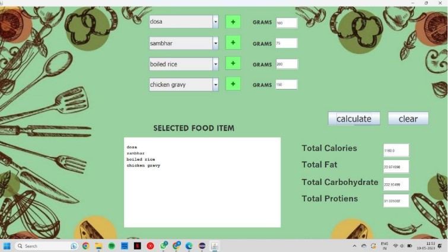

# Calorie Calculator with South Indian Meal Plan

Welcome to the Calorie Calculator! This application helps users calculate the calories of their meals, with a special feature that displays calorie counts for traditional South Indian meal plans.

## Table of Contents
- [Features](#features)
- [Screenshots](#screenshots)
- [Installation](#installation)
- [Usage](#usage)
- [Technologies Used](#technologies-used)
- [Contributing](#contributing)
- [License](#license)
- [Acknowledgements](#acknowledgements)

## Features
- **Calorie Calculation**: Calculate the calories for individual foods and meals.
- **User Management**: Register and login to save meal plans.
- **South Indian Meal Plans**: View calorie information for traditional South Indian meals.
- **Database Integration**: Store and retrieve data using MySQL.

## Screenshots




## Installation

### Prerequisites
- Java Development Kit (JDK)
- MySQL

### Steps
1. **Clone the repository**:
    ```sh
    git clone https://github.com/yourusername/calorie-calculator.git
    ```
2. **Navigate to the project directory**:
    ```sh
    cd calorie-calculator
    ```
3. **Set up the MySQL database**:
    - Create a new database:
      ```sql
      CREATE DATABASE calorie_calculator;
      ```
    - Import the database schema:
      ```sql
      USE calorie_calculator;
      SOURCE path/to/schema.sql;
      ```
    - Update database configuration in `src/main/resources/application.properties`.

4. **Build the project**:
    ```sh
    mvn clean install
    ```
5. **Run the application**:
    ```sh
    mvn spring-boot:run
    ```

## Usage
1. **Launch the app**:
    Open your web browser and navigate to `http://localhost:8080`.
2. **Register/Login**:
    Create an account or log in to access personalized features.
3. **Calculate Calories**:
    Enter the food items or select a South Indian meal plan to view calorie details.
4. **Save Meal Plans**:
    Save your favorite meal plans for quick access.

## Technologies Used
- **Backend**:
  - MySQL
- **Frontend**:
  - Java(Swing for GUI)
- **IDE**:
  - IntelliJ IDEA/Eclipse/NetBeans

## South Indian Meal Plan
The application includes a comprehensive list of South Indian meals with their calorie content. Some examples include:

Idli: 39 calories per piece
Dosa: 168 calories per piece
Upma: 192 calories per serving
Sambar: 150 calories per bowl
Pongal: 206 calories per serving
  
## Contributing
Contributions are welcome! Please follow these steps to contribute:
1. **Fork the repository**.
2. **Create a new branch**:
    ```sh
    git checkout -b feature/your-feature-name
    ```
3. **Commit your changes**:
    ```sh
    git commit -m 'Add some feature'
    ```
4. **Push to the branch**:
    ```sh
    git push origin feature/your-feature-name
    ```
5. **Open a Pull Request**.

## License
This project is licensed under the MIT License - see the [LICENSE](LICENSE) file for details.

## Acknowledgements
- Inspired by various calorie counting applications.
- Special thanks to the contributors and the open-source community for their support.

